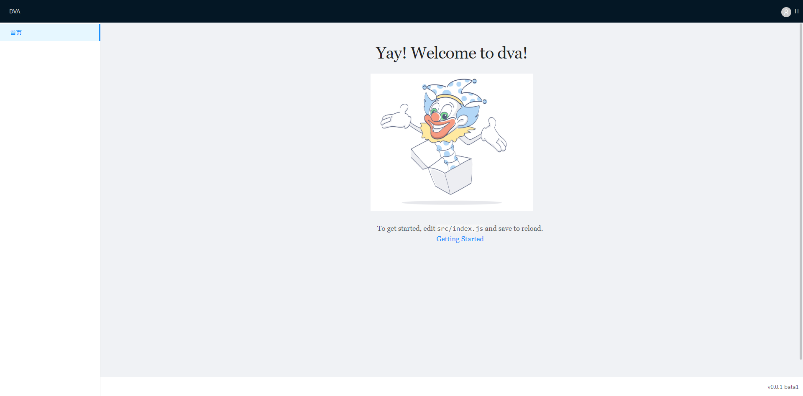

# 使用全局布局



## 设置浏览器可视区域全屏

编辑 `./src/index.less`，增加样式

```diff
+ :global(#root) {
+   position: relative;
+   height: 100%;
+   min-height: 100%;
+   max-height: 100%;
+   width: 100%;
+   min-width: 100%;
+   max-width: 100%;
+   overflow: hidden;
+ }
```

## 创建布局文件

使用 `react-custom-scrollbars`，模拟滚动条

```bash
$ npm install react-custom-scrollbars --save
```

[布局源码](../src/layouts)

## 设置全局局部

编辑 `../src/router.js`

```diff
export default ({ history, app }) => {
+  const GlobalLayout = dynamic({
+    app: app,
+    models: () => [
+      import('./layouts/models/layouts'),
+    ],
+    component: () => import('./layouts'),
+  });
  return (
    <Router history={history}>
      <Switch>
+       <GlobalLayout>
+         <Switch>
            <Route path="/index" exact component={IndexPage}></Route>
            <Redirect to="/index" />
+         <Switch>
+       </GlobalLayout>
      </Switch>
    </Router>
  );
};
```
